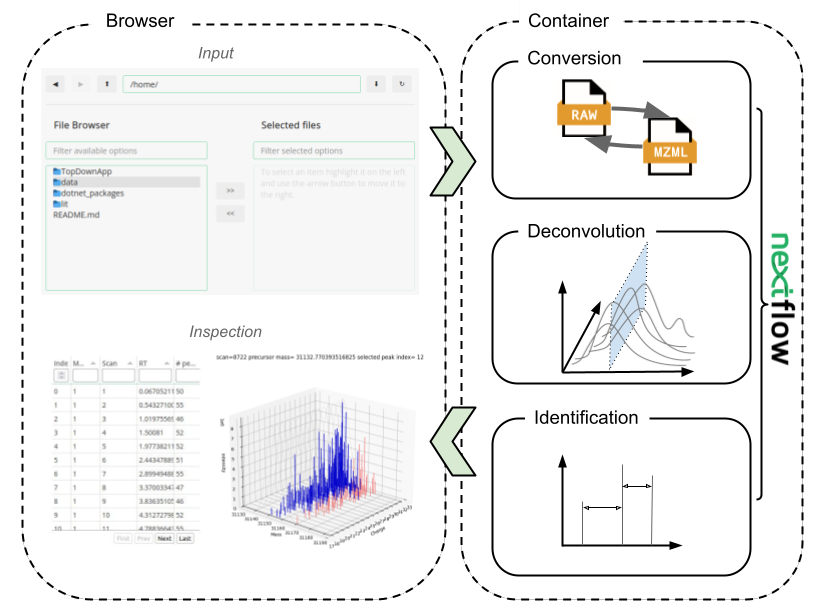

# TopDownApp
This repository contains the resources to develop and build the TopDownApp.
The different components of the app can be found in the respective subfolders.

## Workflow 
The TopDownApp runs nextflow workflows to effect the analysis of data input.
See that folder's README.

## Containers
The workflows use containerised tools and the TopDownApp itself can be containerised. All build recipes (.sdef) can be found here. See that folder's README.

## mzTab
The TopDownApp handles input and output data with HUPO-PSI standard formats. Development code, dedicated im-/exporters, and documentation can be found here. See that folder's README.

## Python panel
The TopDownApp uses panel to build the browser interface for the app. See that folder's README.